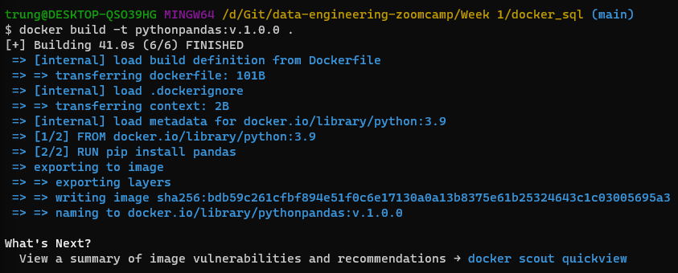

# Introduction to Docker
DE Zoomcamp 1.2.1 - Introduction to Docker: https://youtu.be/EYNwNlOrpr0?si=KFYJis4ePdtCjxML

## What is Docker?
    - Docker is a platform designed to help developers build, share, and run container applications.
    - A container is a standard unit of software that packages up code and all its dependencies so the application runs quickly and reliably from one computing.

## Why should Data Engineers use Docker?
- Local experiments
- Integration tests (CI/CD)
- Reproducibility
- Running pipeline in the cloud (AWS Batch)
- Spark
- Serverless (AWS Lambda, Google functions)

## Install Docker, build and run a container
- Download: https://docs.docker.com/desktop/install/windows-install/
- Run a test image: 
        `docker run hello-world`
        `docker run -it ubuntu bash`
        `docker run -it python:3.9`
        `docker run -it --entrypoint=bash python:3.9`

- Build an image that run a python data pipeline script
    - Pipeline python file

            import sys
            import pandas as pd

            print(sys.argv)

            day = sys.argv[1]

            print(f'Job done successfully for day {day}!')

    - Create `Dockerfile` file:

            FROM python:3.9

            RUN pip install pandas

            WORKDIR /pipelinedirectory
            COPY pipeline.py pipeline.py

            ENTRYPOINT ["python", "pipeline.py"]

    - Build an image

        `docker build -t pythonpandas:v.1.0.0 .`

        

    - Run the built image

        `docker run -it pythonpandas:v.1.0.0 26/01/2024`

- **Q: What is the difference between image and container in Docker?**

        The key difference between a Docker image Vs a container is that a Docker image is a read-only immutable template that defines how a container will be realized. A Docker container is a runtime instance of a Docker image that gets created when the $ docker run command is implemented.

