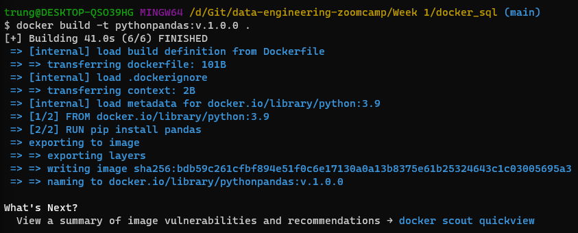
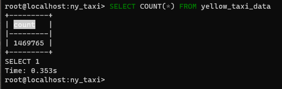
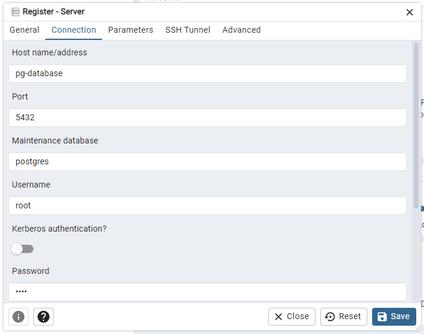

# Introduction to Docker
DE Zoomcamp 1.2.1 - Introduction to Docker: https://youtu.be/EYNwNlOrpr0?si=KFYJis4ePdtCjxML

## What is Docker?

- Docker is a platform designed to help developers build, share, and run container applications.
- A container is a standard unit of software that packages up code and all its dependencies so the application runs quickly and reliably from one computing.

## Why should Data Engineers use Docker?
- Local experiments
- Integration tests (CI/CD)
- Reproducibility
- Running pipeline in the cloud (AWS Batch)
- Spark
- Serverless (AWS Lambda, Google functions)

## Install Docker, build and run a image
- Download: https://docs.docker.com/desktop/install/windows-install/
- Run a test image: 

        `docker run hello-world`
        `docker run -it ubuntu bash`
        `docker run -it python:3.9`
        `docker run -it --entrypoint=bash python:3.9`

- Build an image that run a python data pipeline script
    - Pipeline python file

            import sys
            import pandas as pd

            print(sys.argv)

            day = sys.argv[1]

            print(f'Job done successfully for day {day}!')

    - Create `Dockerfile` file:

            FROM python:3.9

            RUN pip install pandas

            WORKDIR /pipelinedirectory
            COPY pipeline.py pipeline.py

            ENTRYPOINT ["python", "pipeline.py"]

    - Build an image

        `docker build -t pythonpandas:v.1.0.0 .`

        

    - Run the built image

        `docker run -it pythonpandas:v.1.0.0 26/01/2024`

## **Q: What is the difference between image and container in Docker?**
- The key difference between a Docker image Vs a container is that a Docker image is a read-only immutable template that defines how a container will be realized. A Docker container is a runtime instance of a Docker image that gets created when the $ docker run command is implemented.

# Postgres

DE Zoomcamp 1.2.2 - Ingesting NY Taxi Data to Postgres: https://youtu.be/2JM-ziJt0WI?si=80mPrdiJ-uCnJFrX

## Access the database and download the data into local directory

        docker run -it \
        -e POSTGRES_USER=root \
        -e POSTGRES_PASSWORD=root \
        -e POSTGRES_DB=ny_taxi \
        -v d:/git/data-engineering-zoomcamp/week_1/docker_sql/ny_taxi_postgres_data:/var/lib/postgresql/data \
        -p 5432:5432 \
        postgres:13

- Install `pgcli` postgres command line interface: 
        `pip install pgcli`

- Connect to the postgres database above
        `pgcli -h localhost -p 5432 -u root -d ny_taxi`
        `\dt` : list all the available tables of a database
        `\d yellow_taxi_data` : discribe schema/table

## Ingest data into the postgres database using pandas

Donwload data: https://github.com/DataTalksClub/nyc-tlc-data/releases/tag/yellow

Jupyter notebook: [ingesting_data_into_postgres_database.ipynb](ingesting_data_into_postgres_database.ipynb)

Task done successfully:

# pgAdmin

- Download pgAdmin docker image: https://www.pgadmin.org/download/pgadmin-4-container/

        docker run -it \
        -e PGADMIN_DEFAULT_EMAIL="admin@admin.com" \
        -e PGADMIN_DEFAULT_PASSWORD="root" \
        -p 8080:80 \
        dpage/pgadmin4

- Then go to `localhost:8080` to see the interface
- Put two containers into the same network: https://docs.docker.com/engine/reference/commandline/network_create/

        docker network create pg-network

        docker run -it \
        -e POSTGRES_USER=root \
        -e POSTGRES_PASSWORD=root \
        -e POSTGRES_DB=ny_taxi \
        -v d:/git/data-engineering-zoomcamp/week_1/docker_sql/ny_taxi_postgres_data:/var/lib/postgresql/data \
        -p 5432:5432 \
        --network=pg-network \
        --name pg-database \
        postgres:13

        pgcli -h localhost -p 5432 -u root -d ny_taxi

        docker run -it \
        -e PGADMIN_DEFAULT_EMAIL="admin@admin.com" \
        -e PGADMIN_DEFAULT_PASSWORD="root" \
        -p 8080:80 \
        --network=pg-network \
        --name pgadmin \
        dpage/pgadmin4

