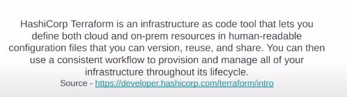
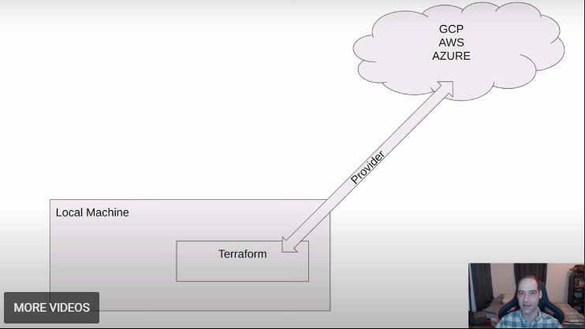
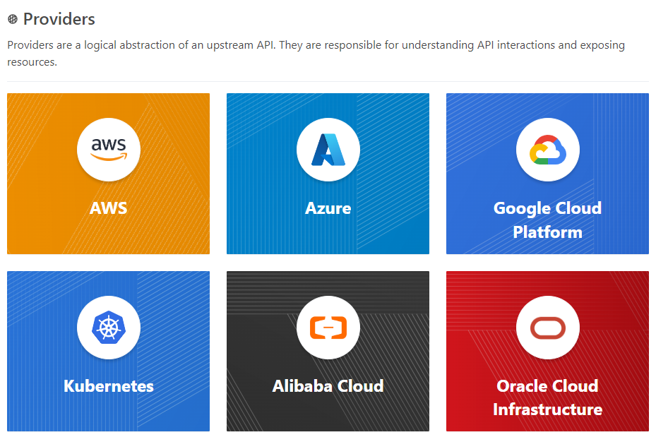

# Introduction to GCP

- Google services:
  - Google Could Storage (GCS): Data Lake (raw data)
  - Big Query: Data Warehouse (cleaned data for analytics, BI)

## Setup for Access
- Create a project
- Create a service account -> Manage keys -> Create a new key -> Download
  `export GOOGLE_APPLICATION_CREDENTIALS="<path/to/your/service-account-authkeys>.json"`
- IAM Roles for Service account:
  - Go to the IAM section of IAM & Admin https://console.cloud.google.com/iam-admin/iam
  - Add these roles in addition to Viewer : Storage Admin + Storage Object Admin + BigQuery Admin
- Enable these APIs for your project:
  - https://console.cloud.google.com/apis/library/iam.googleapis.com
  - https://console.cloud.google.com/apis/library/iamcredentials.googleapis.com

# Introduction to Terraform

  Terraform is a tool for users to help build, change, and version infrastructure safely and efficiently.

- What is Terraform?
  - Open-source tool by HashiCorp, used for provisioning infrastructure resources
  - Supports DevOps best practices for change management
  - Managing configuration files in source control to maintain an ideal provisioning state for testing and production environments
- What is IaC?
  - **Infrastructure-as-Code**
  - Build, change, and manage your infrastructure in a safe, consistent, and repeatable way by defining resource configurations that you can version, reuse, and share.
- Some advantages
  - Infrastructure lifecycle management
  - Version control commits
  - Very useful for stack-based deployments, and with cloud providers such as AWS, GCP, Azure, K8S…
  - State-based approach to track resource changes throughout deployments
- Terrafrom Providers: https://registry.terraform.io/browse/providers

## Create a `main.tf` file:

https://registry.terraform.io/providers/hashicorp/google/latest/docs/guides/provider_reference

    terraform {
      required_providers {
        google = {
            source  = "hashicorp/google"
            version = "5.13.0"
        }
    }
    }

    provider "google" {
        # Configuration options
        project = "de-zoomcamp-2024-412509"
        region  = "australia-southeast2"
    }

`terraform fmt`: to format file

## Execution

  # Refresh service-account's auth-token for this session
  gcloud auth application-default login
  or
  export GOOGLE_APPLICATION_CREDENTIALS="<path/to/your/service-account-authkeys>.json"

  # Initialize state file (.tf)
  terraform init

  # Check changes to new infra plan
  terraform plan -var="project=<your-gcp-project-id>"

  terraform apply
  terraform destroy

## Resource configurations

https://registry.terraform.io/providers/hashicorp/google/latest/docs/resources/storage_bucket#example-usage---life-cycle-settings-for-storage-bucket-objects

    resource "google_storage_bucket" "ny-taxi" {
      name      = "ny-taxi-bucket-de-zoomcamp-2024-412509"
      location    = "ASIA"
      force_destroy = true

      lifecycle_rule {
        condition {
        age = 1
        }
        action {
        type = "AbortIncompleteMultipartUpload"
        }
      }
    }

`terraform plan`: see the changes in the resource plan
`terraform apply`: apply the changes
`terraform destroy`: destroy the resources